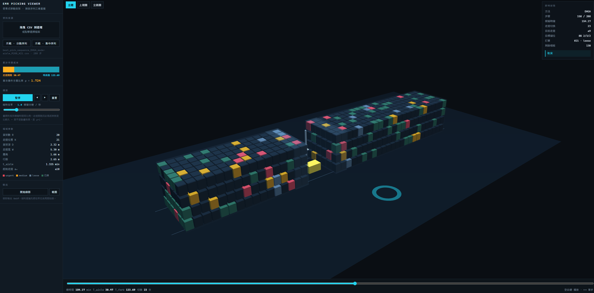
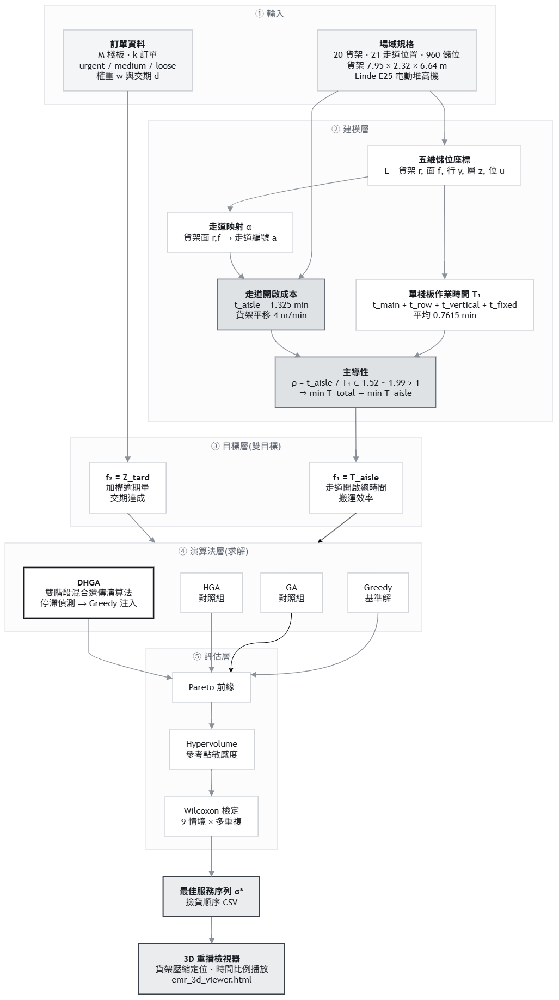
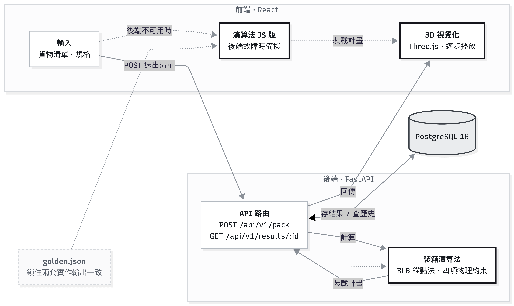
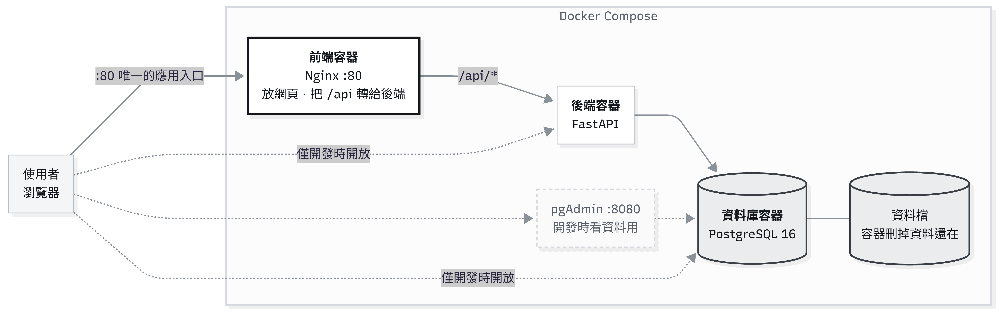
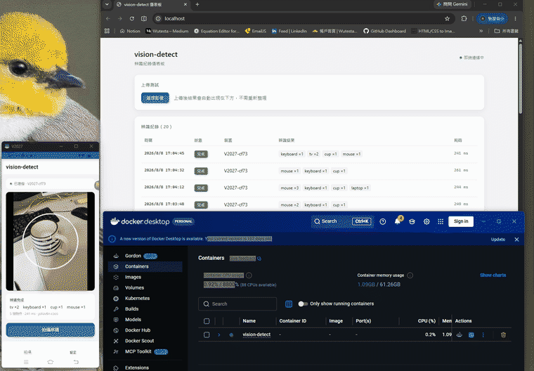
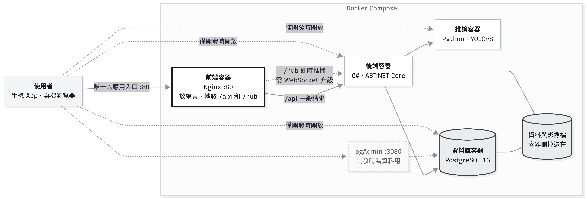
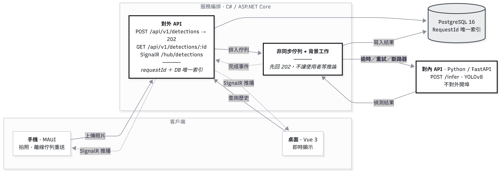

# Testa Wu

Software Engineer — M.S. Software Engineering & Management, NKNU (2026)

## Projects

| Project | What it does |
|---|---|
| **[EMR Picking Sequence Optimizer](#emr-picking-sequence-optimizer)** | Bi-objective scheduling for mobile rack warehouses — opening an aisle costs 1.74× a pallet pick |
| **[3D Container Packing System](#3d-container-packing-system)** | 3D bin-packing that respects forklift aisles, stacking support, and centre of gravity |
| **[Distributed Vision Detection System](#distributed-vision-detection-system)** | Phone → C# orchestration → Python YOLOv8 → results pushed back live over SignalR |

### [EMR Picking Sequence Optimizer](https://github.com/wutesta0101-hue/emr-scheduling)

Bi-objective scheduling for dense mobile rack warehouses, where opening an aisle costs 1.74× more than picking a pallet. Cost model derived from forklift specifications; dual-stage hybrid genetic algorithm; interactive 3D replay.
`Operations Research` `Genetic Algorithms` `Three.js r128` `Node.js worker pool` `AutoCAD`

**▶ [Live Demo](https://wutesta0101-hue.github.io/emr-scheduling)** · [Full README](https://github.com/wutesta0101-hue/emr-scheduling#readme) · [中文版](https://github.com/wutesta0101-hue/emr-scheduling/blob/main/README.zh-TW.md)

<b>Architecture</b>

---

### [3D Container Packing System](https://github.com/wutesta0101-hue/container-packing)

3D Bin-Packing with forklift aisle constraints, stacking density rules, and centre-of-gravity tracking — the physical rules most packing demos ignore.
`Operations Research` `Python 3.12 / FastAPI` `React 19` `React Three Fiber` `PostgreSQL 16` `Docker Compose`

**▶ [Live Demo](https://wutesta0101-hue.github.io/container-packing)** · [Full README](https://github.com/wutesta0101-hue/container-packing#readme) · [中文版](https://github.com/wutesta0101-hue/container-packing/blob/master/README%28zh%29.md)

<b>Architecture &amp; container topology</b>

---

### [Distributed Vision Detection System](https://github.com/wutesta0101-hue/vision-detect)

Phone captures a photo → C# service orchestration → Python YOLOv8 inference → results pushed back to the desktop over SignalR. Two languages, and three failure modes handled by design: duplicate resends, downstream outage, and long-running work.
`C# / ASP.NET Core 8` `Python / FastAPI` `YOLOv8` `Vue 3` `.NET MAUI` `SignalR` `PostgreSQL 16` `Docker Compose`

[Full README](https://github.com/wutesta0101-hue/vision-detect#readme) · [中文版](https://github.com/wutesta0101-hue/vision-detect/blob/main/README%28zh%29.md)

<b>Architecture &amp; container topology</b>

---
## Writing

- [How I Built a 3D Container Packing Engine That Respects Physics — Not Just Math](https://medium.com/@wutesta0101/a4e28c672c74) `3D Bin-Packing · Forklift Constraints`

---

## Tech Stack

`Python` `FastAPI` `SQLAlchemy` `Pydantic` `PostgreSQL` `Docker Compose`
`C#` `.NET 8` `ASP.NET Core` `EF Core` `SignalR` `.NET MAUI` `xUnit`
`React` `Vue 3` `Vite` `Zustand` `Pinia` `Three.js` `React Three Fiber` `Node.js`
`YOLOv8` `PyTorch` `Genetic Algorithms` `Numerical Methods` `AutoCAD`

